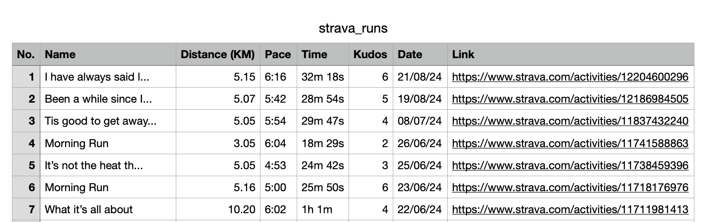

# About



**strava-runs-to-csv** is a Node.js application that allows you to easily fetch all of your running activities from Strava and export them into a neatly formatted CSV file. The generated CSV includes useful headers such as run number, activity name, distance, pace, time, kudos count, date of run, and a link to view each run on Strava.

This tool provides a simple and organized way to view all your runs and stats in one place, without the need to endlessly scroll through Strava. It's a great way to visualize your progress, analyze your running data, and keep track of your achievements.


# Built With

* [![Node.js][Node.js]][Node-url]
* [![Express.js][Express.js]][Express-url]
* [![TypeScript][TypeScript]][TypeScript-url]

  <!-- GETTING STARTED -->
# Getting Started
## Prerequisites

Before you begin, ensure you have the following:

1. **Strava API Account**: To access your running data, you need to create a Strava account and register an API application.

   - Visit the [Strava Developer Portal](https://www.strava.com/settings/api).
   - Log in with your existing Strava account, or create a new one if needed.
   - Click on **Create & Manage Your App** to register a new application.
   - Complete the required fields such as **Application Name**, **Website**, and **Authorization Callback Domain** (make sure to set this to `localhost:3000`).
   - Once your application is created, you will be provided with a **Client ID** and **Client Secret**.

2. **Node.js and npm**: Make sure you have [Node.js](https://nodejs.org/) installed on your system, which includes `npm` (Node Package Manager). This project requires Node.js to run the server and `npm` to install dependencies.

## Installation

1. Clone the repo
   ```sh
   git clone https://github.com/FionnMcA/strava-runs-to-csv.git
   ```
2. Install NPM packages
   ```sh
   npm install
   ```
3. Enter your Strava API Application credentials in `.env`
   ```ts
   STRAVA_CLIENT_ID=YOUR_CLIENT_ID
   STRAVA_CLIENT_SECRET=YOUR_CLIENT_SECRET
   STRAVA_REDIRECT_URI=http://localhost:3000
   ```
# Usage

Once you have set up the `strava-runs-to-csv` application and installed all dependencies, you can start using it to fetch your running data from Strava and export it to a CSV file.

## Running the Application

1. **Compile TypeScript Code**  
   Before running the application, make sure to compile the TypeScript code to JavaScript. Open your terminal, navigate to the project directory, run the following command:
   ```sh
   npx tsc
   ```
2. **Start the Application**  
   Then run the following command to start the application:
   ```sh
   node dist/runs-to-csv.js`
   ```
3. **Authorize with Strava**  
   Open your web browser and navigate to the following URL to authorize the application with your Strava account:
   ```sh
   http://localhost:3000/auth
   ```
   You will be redirected to Strava's authorization page. Log in and authorize the application to access your running data.

   After granting authorization, you will be redirected to a confirmation page at `/authorization`. This page will prompt you to close the tab, and the application will begin fetching     your running data and generating the CSV file.

4. **Generate the CSV File**  
   After authorizing the application, it will automatically fetch your running data and generate a CSV file named `strava_runs.csv` in the project directory. The CSV file will include the following details:
   
   - **Run Number**: Sequential number of the run
   - **Activity Name**: Name of the run activity
   - **Distance (KM)**: Distance covered in kilometers
   - **Pace**: Average pace of the run
   - **Time**: Duration of the run
   - **Kudos Count**: Number of kudos received
   - **Date**: Date of the run
   - **Link to View the Run**: URL to view the run on Strava

   You can open this CSV file with any spreadsheet software or text editor to view and analyze your running data.


<!-- MARKDOWN LINKS & IMAGES -->
[Node.js]: https://img.shields.io/badge/Node.js-339933?style=for-the-badge&logo=nodedotjs&logoColor=white
[Node-url]: https://nodejs.org/
[Express.js]: https://img.shields.io/badge/Express.js-000000?style=for-the-badge&logo=express&logoColor=white
[Express-url]: https://expressjs.com/
[TypeScript]: https://img.shields.io/badge/TypeScript-007ACC?style=for-the-badge&logo=typescript&logoColor=white
[TypeScript-url]: https://www.typescriptlang.org/

